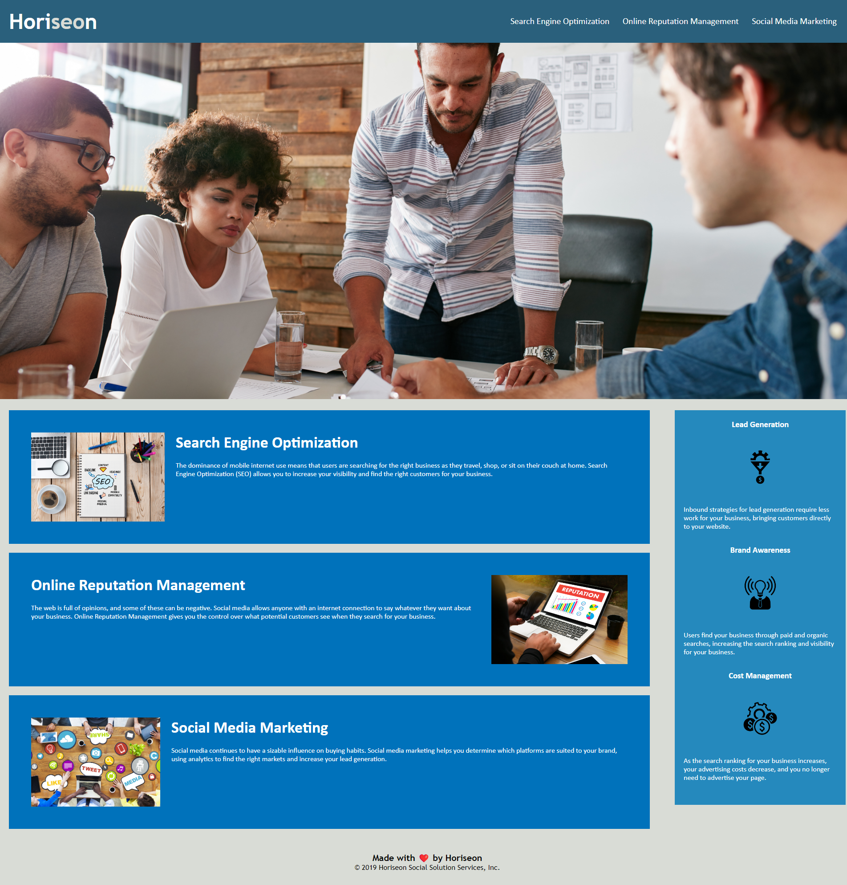
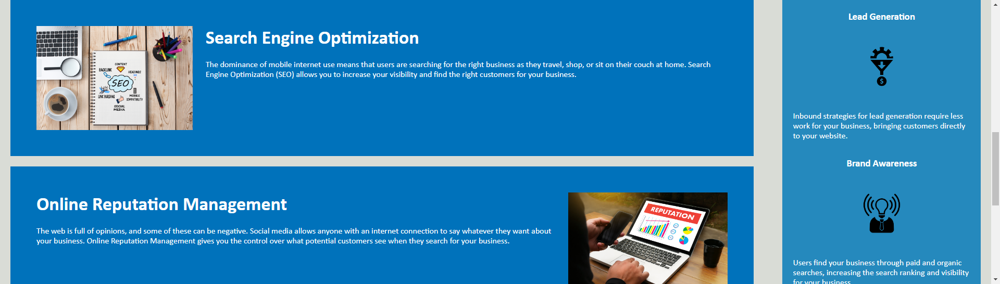

# Horiseon-Refactor

## Technology Used 

| Technology Used         | Resource URL           | 
| ------------- |:-------------:| 
| HTML    | [https://developer.mozilla.org/en-US/docs/Web/HTML](https://developer.mozilla.org/en-US/docs/Web/HTML) | 
| CSS     | [https://developer.mozilla.org/en-US/docs/Web/CSS](https://developer.mozilla.org/en-US/docs/Web/CSS)      |   
| Git | [https://git-scm.com/](https://git-scm.com/)     |    

## Description 
This project involved research into accessibility standards in HTML in order to meet those standards without changing the look of the website itself. This was done through the use of semantic elements available in HTML. I also consolidated the classes and element stylings in the CSS file.

[Visit the Deployed Site](https://fenriragni.github.io/horisien-refactor/)



## Table of Contents

* [Code Refactor Example](#code-refactor-example)
* [Usage](#usage)
* [Learning Points](#learning-points)
* [Author Info](#author-info)
* [Credits](#credits)
* [License](#license)


## Code Refactor Example

```html
  <div class="benefits">
        <div class="benefit-lead">
            <h3>Lead Generation</h3>
            
            <p>
                Inbound strategies for lead generation require less work for your business, bringing customers directly to your website.
            </p>
        </div>
        <div class="benefit-brand">
            <h3>Brand Awareness</h3>
            
            <p>
                Users find your business through paid and organic searches, increasing the search ranking and visibility for your business.
            </p>
        </div>
        <div class="benefit-cost">
            <h3>Cost Management</h3>
            
            <p>
                As the search ranking for your business increases, your advertising costs decrease, and you no longer need to advertise your page.
            </p>
        </div>
    </div>
```

Converting the above non-semantic div with the class of 'benefits' to an appropriate [semantic element](https://www.w3schools.com/html/html5_semantic_elements.asp). 

```html
<aside class="benefits">
        <section>
            <h3>Lead Generation</h3>
                
                    <p>
                        Inbound strategies for lead generation require less work for your business, bringing customers directly to your website.
                    </p>
        </section>

        <section>
            <h3>Brand Awareness</h3>
                
                    <p>
                        Users find your business through paid and organic searches, increasing the search ranking and visibility for your business.
                    </p>
        </section>
        <section>
            <h3>Cost Management</h3>
                    
                        <p>
                            As the search ranking for your business increases, your advertising costs decrease, and you no longer need to advertise your page.
                        </p>
        </section>
    </aside>
```

This change require some additional modification to the CSS selector: 

```css
.benefits {
    margin-right: 20px;
    padding: 20px;
    clear: both;
    float: right;
    width: 20%;
    height: 100%;
    font-family: 'Gill Sans', 'Gill Sans MT', Calibri, 'Trebuchet MS', sans-serif;
    background-color: #2589bd;
}

.benefit-lead {
    margin-bottom: 32px;
    color: #ffffff;
}

.benefit-brand {
    margin-bottom: 32px;
    color: #ffffff;
}

.benefit-cost {
    margin-bottom: 32px;
    color: #ffffff;
}

.benefit-lead h3 {
    margin-bottom: 10px;
    text-align: center;
}

.benefit-brand h3 {
    margin-bottom: 10px;
    text-align: center;
}

.benefit-cost h3 {
    margin-bottom: 10px;
    text-align: center;
}

.benefit-lead img {
    display: block;
    margin: 10px auto;
    max-width: 150px;
}

.benefit-brand img {
    display: block;
    margin: 10px auto;
    max-width: 150px;
}

.benefit-cost img {
    display: block;
    margin: 10px auto;
    max-width: 150px;
}
```

No longer targeting the element on the page with the three different classes but instead the css selector targeting a single 'benefits' class and consolidating similar attributes

```css
.benefits {
    margin-right: 20px;
    padding: 20px;
    clear: both;
    float: right;
    width: 20%;
    height: 100%;
    font-family: 'Gill Sans', 'Gill Sans MT', Calibri, 'Trebuchet MS', sans-serif;
    background-color: #2589bd;
    margin-bottom: 32px;
    color: #ffffff;

}

.benefits h3 {
    margin-bottom: 10px;
    text-align: center;
}

.benefits p {
    margin-bottom: 32px;
    color: #ffffff;
}

.benefits img {
    display: block;
    margin: 10px auto;
    max-width: 150px;
}
```

## Usage 
Clicking on any of the navigation links at the top:


 Takes you to the corresponding section on the page:


## Learning Points 

Some things I've learned through this project:

* How deep HTML is made to be accessible: Most elements have the ability to add accesssibility attributes at very little work from the developer
* Semantic elements are extremely useful since they can take on a lot of global attributes
* Class and ID "hooking" in CSS
* Referencing an image as a background image allows for a different style when viewed
* Good coding habits like commenting, efficient code, and researching element functions through documentation
* Good workflow habits like saving work often and committing often to github
## Author Info
#### Alonso Ampuero 
* [LinkedIn](https://www.linkedin.com/in/alonsoampuero/)
* [Github](https://github.com/FenriRagni)

## Credits

Janet aka [TwixmixyJane](https://github.com/TwixmixyJanet) for troubleshooting and runnning ideas back and forth with me throughout the project. 

## License
MIT License Copyright (c) 2023 FenriRagni/Alonso Ampuero